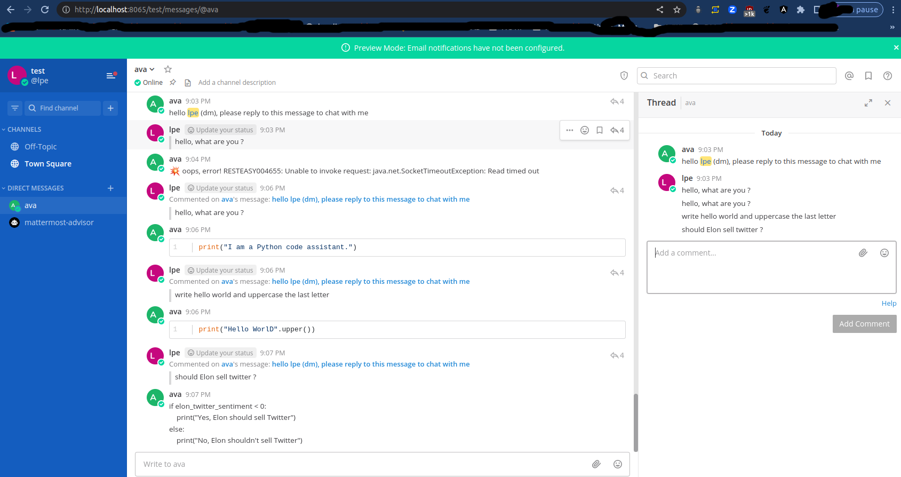
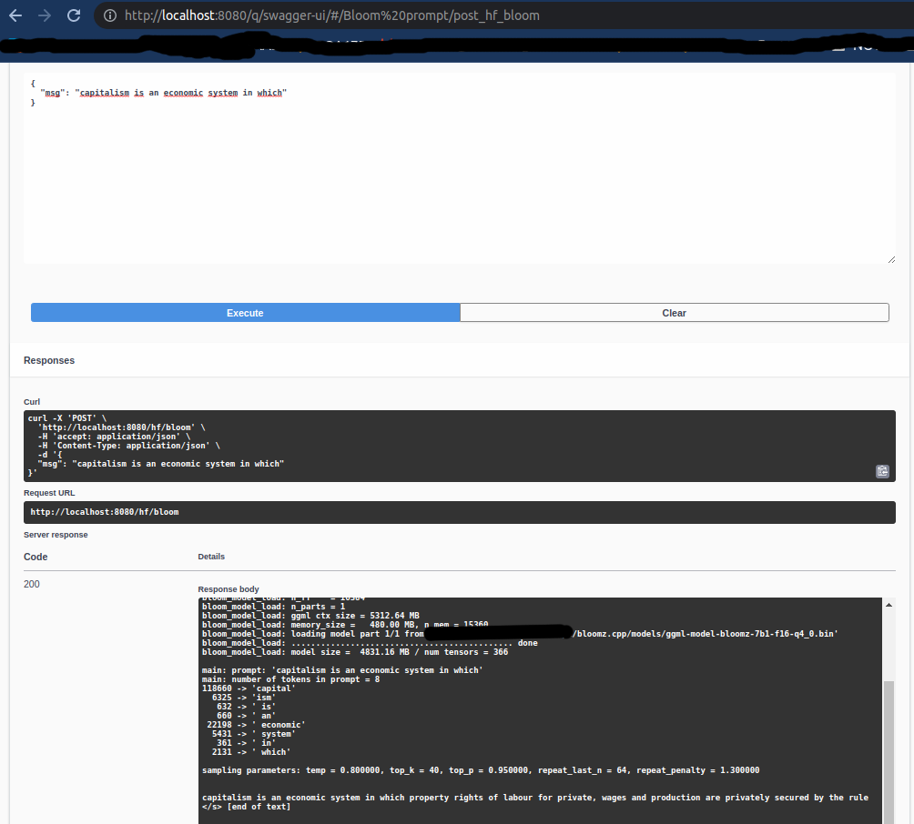

# What is it ?

Ava is a general purpose bot/API interacting with NLP/LLM models.    
Ava is named after https://en.wikipedia.org/wiki/Ex_Machina_(film)

# Overview

Ava has two components

- a bot: better suited for a chat flow, its default setup is to join your Mattermost server https://mattermost.com/ and wait for a user to chat with.
- a REST API: better suited for completions or general purpose interactions.
# Screenshots

Bot usage (see below) : chat with the bot using a reply thread



API usage (see below) : prompt



# What models or APIs does it support ?

OpenAI's models are not the sole actors in LLMs ;)

Other models are : Stanford Alpaca, BLOOM, Facebook/Meta LLaMA/OPT-175B, Salesforce CodeGen, Google PaLM/BERT, Amazon AlexaTM

OpenAI Research used [human instruction training with InstructGPT](https://platform.openai.com/docs/model-index-for-researchers/instructgpt-models) so it may easier to prompt its for-profit bot than with other models.    

*some* models are foundation models and were not instructed for straight question answering, may produce toxic content : you need to prompt them using few-shot examples, user intentions, and think of the answer as a natural continuation of your prompt.        

See prompting tips at https://github.com/facebookresearch/llama/blob/main/FAQ.md#2-generations-are-bad

### Currently supported models are :

- cloud/API based: ChatGPT-3+ (thru OpenAI APIs, an API key is required)
- local usage: BLOOM


### Shall I use self-hosted models or cloud based models ?

Short answer : it depends.

*🕵️ Given the nature of NLP, the less a 3rd party vendor can inspect your usage the better*  
This has been recently covered by this UK GCHQ article : https://www.telegraph.co.uk/business/2023/03/14/gchq-warns-chatgpt-rival-chatbots-security-threat/

This is why Ava provides both cloud based usage and self-hosted local usage : if you are not ok with sending prompts to a cloud, then use local models.

Why is it using Mattermost as a prefered chat relay ? because it is open source and self-hosted.  
Slack or Discord are not. For veterans, supporting [UnrealIRCd](https://www.unrealircd.org/) is of interest. For decentralized conversations, [Matrix](https://matrix.org/) is of interest too.

# Considerations and responsible use of AI

Keep in mind *it should not be used for High-Stakes Decision-Making*, see below

- https://twitter.com/sama/status/1635136281952026625 (Sam Altman, "we definitely need more regulation on ai" )
- https://time.com/6247678/openai-chatgpt-kenya-workers/ (How did they make ChatGPT less toxic ?)
- https://oecd.ai/en/catalogue/tools/bigscience-bloom-responsible-ai-license-rail-1-0 (RAIL Responsible AI License)
- https://dl.acm.org/doi/10.1145/3442188.3445922 (On the Dangers of Stochastic Parrots: Can Language Models Be Too Big? 🦜)
- https://hal.archives-ouvertes.fr/hal-03368037/document (A systematic framework for describing ML’s effects on GHG emissions 🌱)
- https://learn.microsoft.com/en-us/legal/cognitive-services/openai/transparency-note#considerations-when-choosing-a-use-case (see Considerations)

# Quickstart

If you want to use local models downloaded from Huggingface or other places : make sure you have enough RAM and disk space !  
For example the pytorch model of `bigscience/bloomz-7b1` weights at 14GB and requires around 10GB of RAM for its q4 [quantization](https://github.com/NouamaneTazi/bloomz.cpp).

1. install a JDK17 from https://sdkman.io/
2. start the on-premise Mattermost chat server `docker compose up`
3. navigate to its http://localhost:8065, create yourself an account for demonstration purposes
4. create a team named `test` and an account `ava@ava.co` for the bot (hint: use "Invite people", copy the "Invite" invitation link in another browser window to create the bot account)
5. in `src/main/resources/application.properties` set `bot.mmost.enabled=false`
6. reconfigure the bot server url, team, login and password in this file then set `bot.mmost.enabled=true` 
7. optional if you would like to use the OpenAI cloud models : `env export` a `CLIENT_OPENAI_SECRET_KEY`. Make sure you understand and cap your billing charges.
8. run Ava : `./gradlew quarkusDev`
9. the bot shall join the default chatroom "Town Square" and greet you: if it does not, check the server logs
10. open a Direct message with the bot, and chat with it.
11. if you want to use a Web UI for the REST API: it is located at http://localhost:8080/q/swagger-ui/


# Sample usage

- bot: TBD
- REST API:
```
curl -v -XPOST -H 'Content-Type: application/json' -d '{"msg":"translate \"Hi, how are you?\" in Spanish:"}' http://localhost:8080/hf/bloom
```
```
sampling parameters: temp = 0.800000, top_k = 40, top_p = 0.950000, repeat_last_n = 64, repeat_penalty = 1.300000  
translate "Hi, how are you?" in Spanish: Me encuentro muy bien. ¿Cómo estas tú? Yo estoy?: me alegro</s> [end of text]
```

# Frameworks & tools used

- https://quarkus.io/

If you are looking for other Java frameworks please consider Wenqi Glantz's work at https://github.com/wenqiglantz/chatgpt-whisper-spring-boot or Vayne's work at https://github.com/flashvayne/chatgpt-spring-boot-starter

- https://github.com/maruTA-bis5/mattermost4j by Takayuki Maruyama
- Postgres for persistence

# License

CC BY NC 4.0 (allowing only non-commercial use)

# Credit

- BLOOM thanks to Nouarame Tazi's work https://github.com/NouamaneTazi/bloomz.cpp
- https://github.com/antimatter15/alpaca.cpp#credit

# Disclaimer

Since Facebook's LLaMA is a leaked model, the 🐱 is out of the bag but no instructions will be provided on how to get the required files.
 
